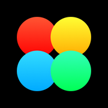

# Aura


iOS app: daily emotions, notes, tags, statistics, settings (notifications, Face ID).

## Requirements

- Xcode 16+ (app target iOS 17.6+, Swift 5)
- Apple Developer team in Xcode for a physical device

## Run

1. Open `Aura.xcodeproj` (SnapKit resolves on first open).
2. Scheme **Aura**, pick simulator or device.
3. Signing: target Aura → your team (bundle id `solovev.*`).
4. Run (⌘R).

### Unit tests (CLI)

```bash
xcodebuild test \
  -project Aura.xcodeproj \
  -scheme Aura \
  -destination 'platform=iOS Simulator,name=iPhone 16' \
  -only-testing:AuraTests
```

Pick a `-destination` from `xcodebuild -showdestinations` if needed.

### SwiftLint

```bash
brew install swiftlint && swiftlint
```

## Tests

| Target | What |
|--------|------|
| `AuraTests` | `SettingsViewModel` (alerts, persistence), `LogViewModel` (streaks, emotions, records) — all against mocks, not UI. |
| `AuraUITests` | A few smoke checks (welcome, log). |

Most **screen/UI complexity** (statistics, tag collection, coordinators) has **no** dedicated tests yet; the unit suite sits where logic was easiest to mock (`Settings` / `Log` VM + `CoreDataServiceProtocol`).

## Layout

UIKit, coordinators, MVVM where used. Services wired through `AppDependencies` → `AppCoordinator`. Details: [docs/ARCHITECTURE.md](docs/ARCHITECTURE.md).

## CI

`.github/workflows/ios.yml`: SwiftLint + `AuraTests` on push/PR to `main` or `master`. UI tests are in the Xcode scheme but not run in that job.

## Optional local config

Copy `Config/Local.xcconfig.example` → `Config/Local.xcconfig` (gitignored) if you wire xcconfigs later. Do not commit secrets.

## Changelog

[CHANGELOG.md](CHANGELOG.md)

## Screenshots

### Welcome

<p align="center">
    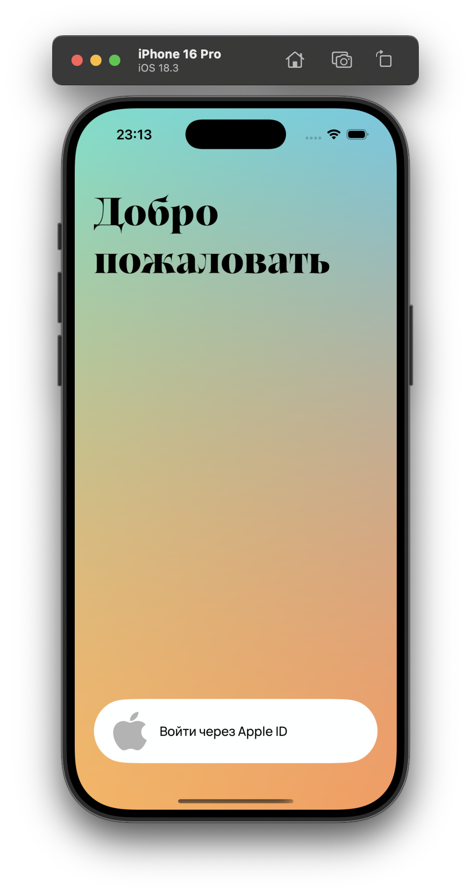
</p>

### Log

<p align="center">
    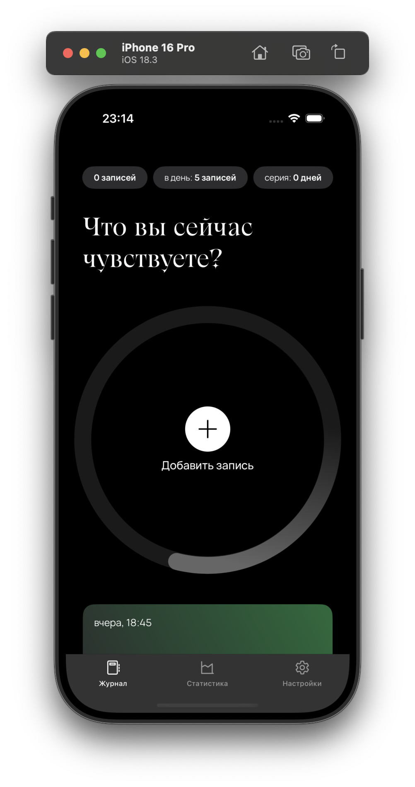
    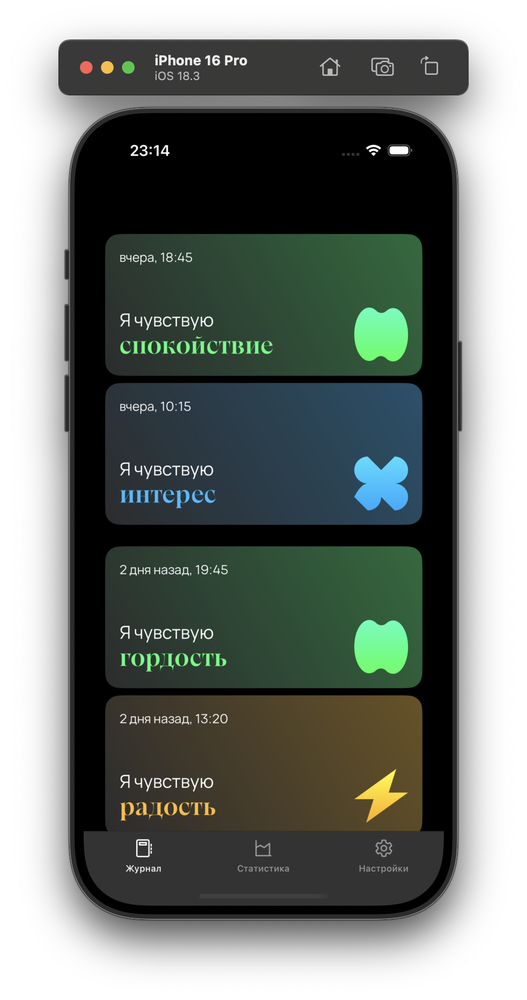
    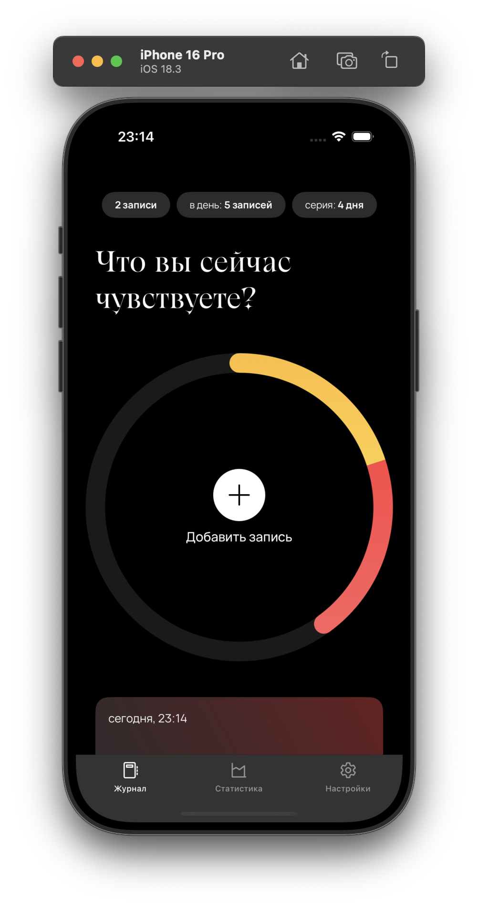
</p>

### Add & edit note

<p align="center">
    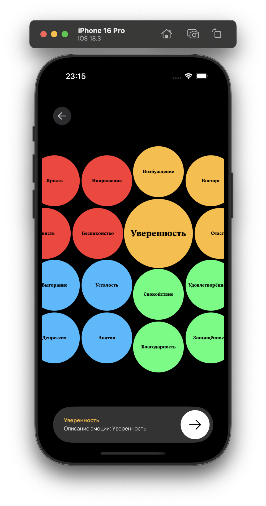
    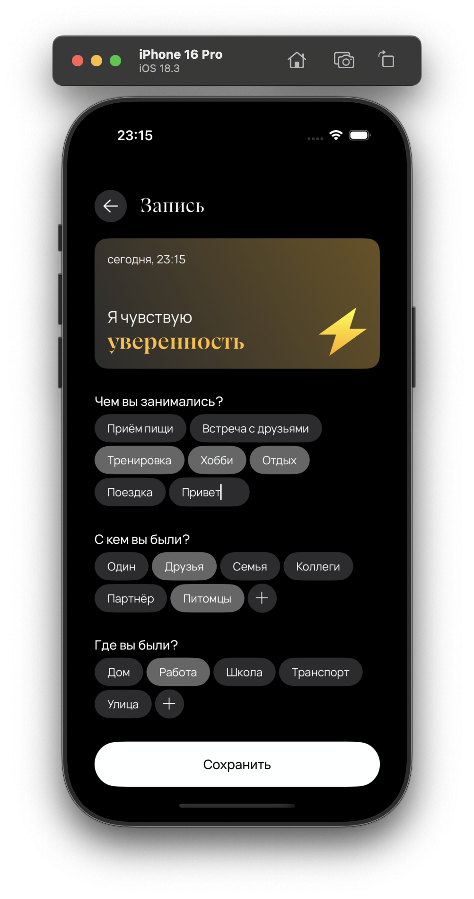
</p>

### Statistics

<p align="center">
    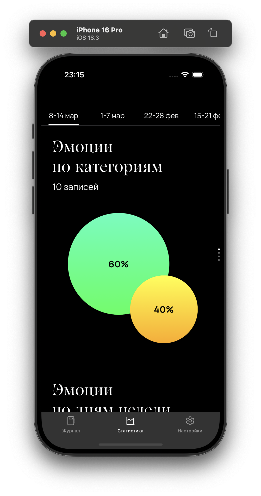
    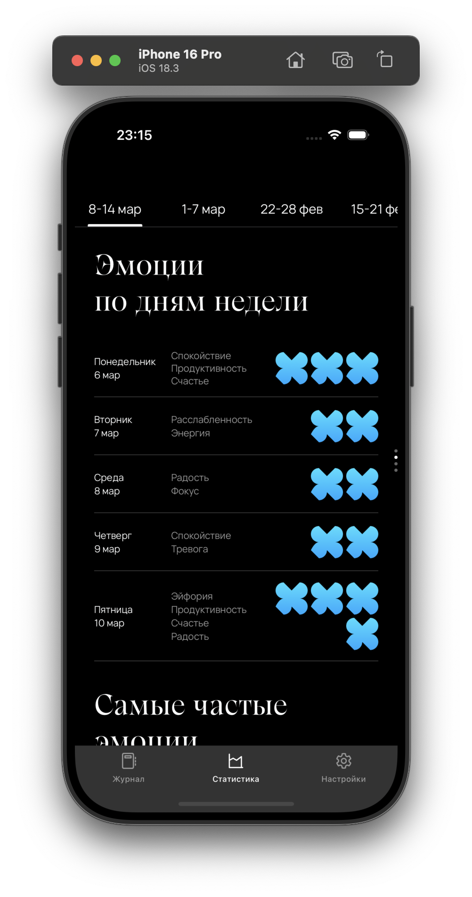
    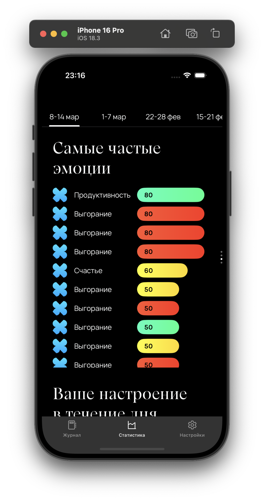
    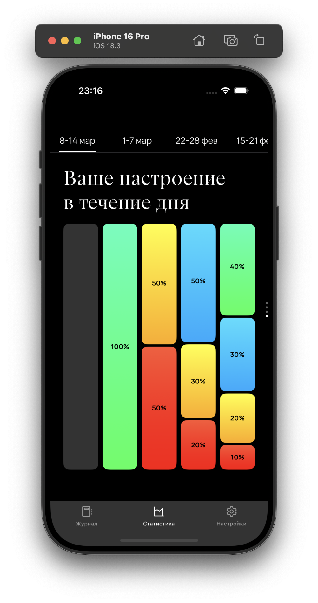
</p>

### Settings

<p align="center">
    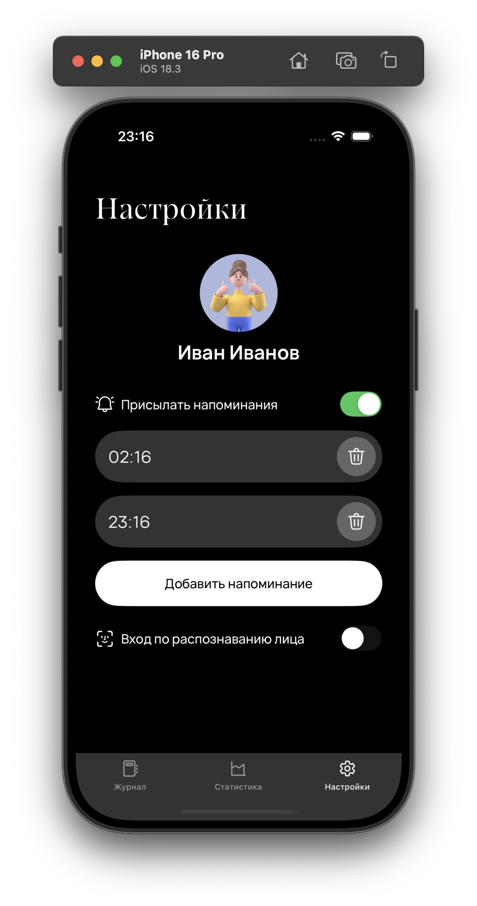
</p>

## License

[LICENSE](LICENSE)
